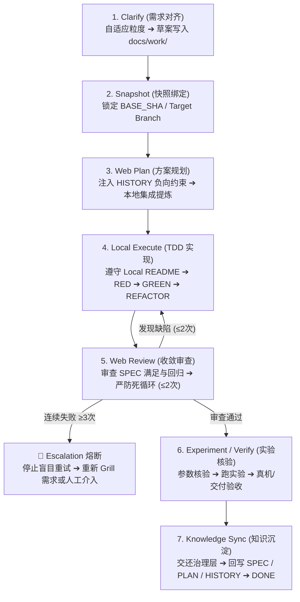

# Spec-Loop (Dual-Dev Execution Engine)

`spec-loop` 是一个由用户主动触发的**单次任务闭环执行器**。

> [!IMPORTANT]
> **核心职责边界**：
> - **`spec-loop` 负责“这一轮怎么高质量完成”**（执行引擎：窄、稳、可插拔）；
> - **`skill-project-organization` 负责“这一轮完成后项目学到了什么”**（常驻治理层：项目大脑与长期记忆）。

---

## 核心模型 (Input ➔ Process ➔ Output ➔ Handoff)

* **输入**：项目当前真相（`AGENT_CORE`, 局部 `README`, 当前 `SPEC`/`PLAN`/`HISTORY`） + 用户新任务
* **过程**：`Clarify ➔ Snapshot ➔ Plan ➔ Local Execute ➔ Web Review ➔ Experiment / Verify`
* **输出**：代码实现 + 验证/Review 结果 + 可沉淀的新经验
* **交付**：交还治理层 ➔ `Knowledge Sync` ➔ 收敛回写 `SPEC.md` / `PLAN.md` / `HISTORY.md`

---

## 核心原则 (10 条铁律)

1. **不发明项目结构**：执行前先读 `AGENT_CORE`、根 `README` 及相关局部 `README`，适配现有体系；
2. **粒度自适应**：小任务在现有总文档中消化，不默认每次滥建新文件；复杂独立功能才升成分 Spec/Plan；
3. **中间态统一进 `docs/work/`**：Grill 结果、Web GPT 方案草案、未验证设计先入 `docs/work/`，绝不直接污染正式 SPEC/PLAN；
4. **Web GPT 绑定快照**：必须显式绑定 `repo / branch / BASE_SHA / TARGET_SHA`，严防审错版本；
5. **注入历史失败教训**：Plan/Review Prompt 必须注入 `HISTORY.md` 中的失败路线，禁止重复建议已失败方法；
6. **审查全面收敛**：不仅审代码，重点审 SPEC 满足、PLAN 漂移、测试证据、scope creep、README 规则与文档同步；
7. **禁止无限循环**：同类问题连续失败 2 次记录 TRY，3 次仍失败立即触发 STOP 熔断（re-plan / grill / 架构重审）；
8. **统一收敛出口**：任务结束前必须执行 `Knowledge Sync + Convergence`，由治理层收敛；
9. **执行器可插拔**：兼容 Superpowers / grill-me / tdd 等工具，但绝不强绑定；
10. **渐进式披露结构**：主流程保持敏捷，各专项策略见 `references/`。

---

## 主执行流水线 (Pipeline)

---

## 专项参考索引 (References)

* **粒度自适应规则**：[references/adaptive-granularity.md](references/adaptive-granularity.md)
* **Web Plan 注入规范**：[references/web-plan.md](references/web-plan.md)
* **TDD 与 Local README 门禁**：[references/tdd-execution.md](references/tdd-execution.md)
* **收敛审查与自证核验**：[references/web-review.md](references/web-review.md)
* **防死循环熔断升级**：[references/anti-loop-escalation.md](references/anti-loop-escalation.md)
* **统一知识同步与收敛**：[references/knowledge-sync.md](references/knowledge-sync.md)
* **GitHub Remote 模式**：[references/github-mode.md](references/github-mode.md)
* **Local Git / No-Git 降级模式**：[references/local-git-mode.md](references/local-git-mode.md)
