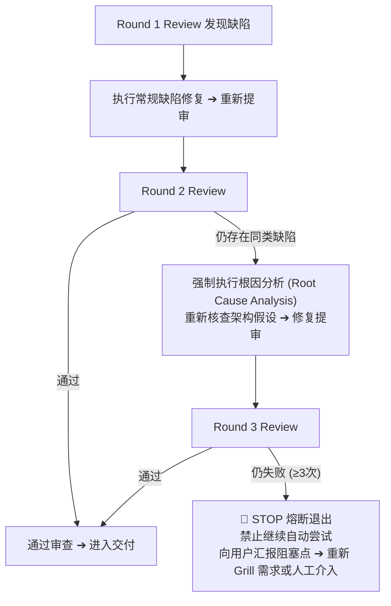

# 防死循环与升级机制 (Anti-Loop Escalation)

严禁让 AI 陷入 `Review ➔ Fix ➔ Review ➔ Fix` 的无止境重试黑洞。必须设定硬性升级阶梯：

---

## 熔断升级规则

1. **第 1 次 Review 失败**：
   - 本地 AI 根据 GPT Review 报告中的明确代码/单测缺陷进行点对点修复并补充回归测试。
2. **第 2 次 Review 失败**：
   - 严禁盲目小修小补；
   - 必须停下来进行**根本原因分析（RCA）**，检查是否是对 SPEC 理解偏差或使用了错误的底层依赖。
3. **第 3 次仍未通过（连续 3 次失败）**：
   - **立即触发 STOP 熔断**；
   - 冻结当前分支，记录已尝试路径及失败日志至 `docs/work/escalation.md`；
   - 告知用户：“当前实现多次未能通过审查，底层设计可能存在根本冲突，建议重新执行 `/grill-me` 重新审视需求或人工指导”。
